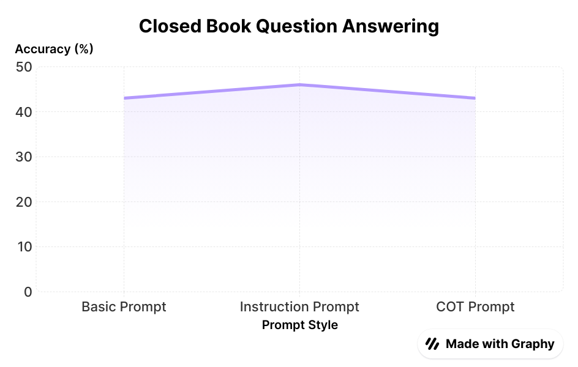
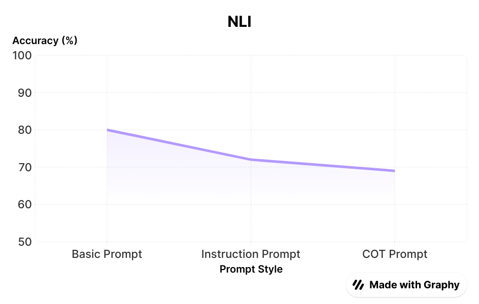
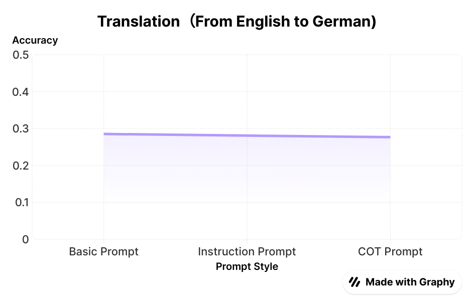
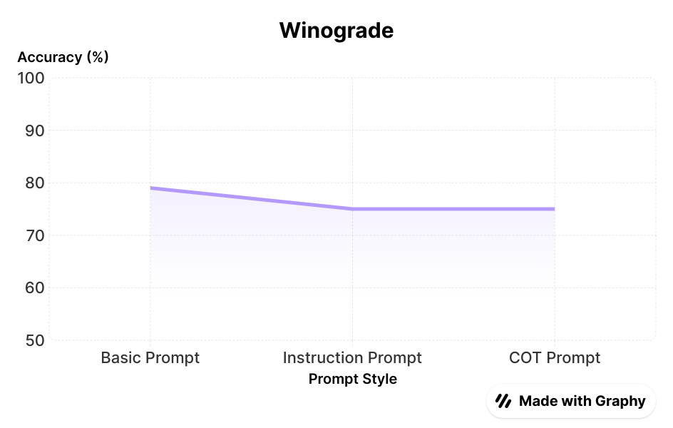

# The Impact of Prompting Style on LLM In-Context-Learning Performance

## 1. Project Overview

This project evaluates the performance differences of various prompt methods—**Basic Prompt**, **Instruction Prompt**, and **Chain-of-Thought (CoT) Prompt**—across multiple natural language processing (NLP) tasks, including:

- Winograd-Style Task
- Closed-Book Question Answering
- Translation
- Natural Language Inference (NLI)

It aims to support the design of better prompts to enhance large language models’ (LLMs) performance in **in-context learning** through data analysis and visualization.

---

## 2. Background and Research Objectives

One effective way to improve LLM output is to include examples in the prompt, a method known as **few-shot prompting**. Common prompt styles include:

### 🟢 Basic QA Prompt
```
Q: What is the capital of France?  
A: Paris  
Q: Who wrote the play 'Hamlet'?  
A: William Shakespeare  
Q: What is the boiling point of water in Celsius?  
A: 100  
Q: What was the first name of Hudson in Upstairs Downstairs?  
A:  
```

### 🔵 Instruction Prompt
```
Instruction: Answer the question based only on your general knowledge.  
Q: What is the capital of France?  
A: Paris  

Instruction: Answer the question using only facts you know.  
Q: Who wrote the play 'Hamlet'?  
A: William Shakespeare  
...
```

### 🟡 Chain-of-Thought Prompt
```
Instruction: Answer the question based only on your general knowledge.  
Q: What is the capital of France?  
A: France is a country in Europe. Its capital city is where the national government is located... The answer is Paris.  
...
```

Prompt engineering is one of the most **cost-effective** and **efficient** ways to enhance LLM performance. However, systematic, quantitative comparisons of prompt styles remain limited.

This project explores:

1. To what extent does prompt style affect GPT-3.5-Turbo performance?
2. Is there a consistently optimal prompt style?

---

## 3. How to Run the Experiment

Based on findings from *Large Language Models as Analogical Reasoners*, using **3 to 5 examples** (K=3–5) yields the best performance across tasks.

- Three examples are manually crafted for each prompt style.
- GPT-3.5 is tested with identical questions using different prompt styles.
- Performance is measured by accuracy or BLEU scores.

---

## 4. Project Structure

```
Prompt-Strategy-Eval/
├── data/               # Task datasets
├── generated_prompts/  # Initial prompts and answers
├── model_inputs/       # Prompts + questions
├── model_outputs/      # LLM-generated responses
├── sample-dataset/     # 100 sample questions
├── evaluation/         # Evaluation logic
├── prompts/            # Three styles of prompts
├── scripts/            # Data processing & evaluation
├── clean/              # Preprocessing scripts
├── closedbookqa/       # Prompts for QA tasks
├── evaluate/           # Evaluation scripts
├── nli/                # NLI task prompts
├── run_gpt3/           # GPT-3.5 invocation scripts
├── samples/            # Sample extraction
├── translation/        # Translation task prompts
├── winogrande/         # Winograd task prompts
```

---

## 5. Results and Findings

### Closed-Book QA Task
- **Instruction Prompt** performed best (46% accuracy).
- **Basic** and **CoT Prompts** slightly lower (43%).



### NLI Task
- **Basic Prompt**: 80% accuracy  
- **Instruction Prompt**: 72%  
- **CoT Prompt**: 69%



### Translation Task
Measured by **BLEU Score**:

| Prompt Style     | BLEU Score |
|------------------|------------|
| Basic Prompt     | 0.2852     |
| Instruction      | 0.2809     |
| Chain-of-Thought | 0.2767     |



### Winograd Task
- **Basic Prompt**: 79% accuracy  
- **Instruction / CoT**: 75% accuracy



---

## 🔍 Conclusion

Prompt style **does influence** LLM performance, but its effect **varies by task**. From the tasks examined:

- **Basic Prompts** often yielded the best results.
- No single prompt style guarantees optimal performance across all tasks.
- It's best to **experiment with multiple styles** based on task complexity and expected output.

---

## 📎 License

MIT License

---
